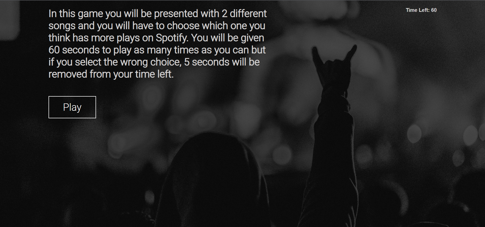
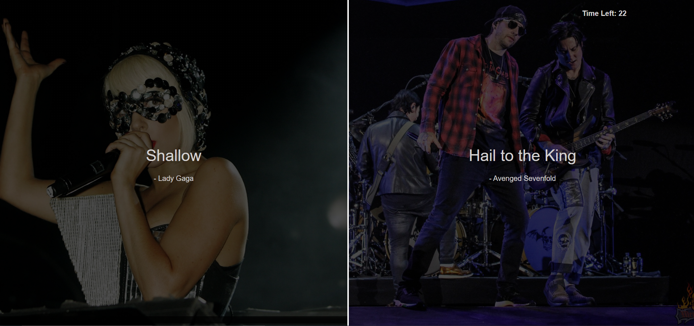

# Song Quiz
A multiple choice quiz to see how well the play knows the popularity of certain songs.
 

## Description

Although this quiz appears on the surface different to the example given, it fulfills all the acceptance criteria and produces a unique and very fun game to play following the criteria provided.
The player is presented with a opening dialogue explaining how to play and a start button to start the game.
When the game is started, a timer countdown starts from 60 seconds, the player is presented with 2 songs and must answer which one they
feel has the most plays on Spotify. 
If the player chooses wrong, 5 seconds is subtracted from the remaining time, giving the player less time to run up a high score.
As soon as the player chooses thier answer, whether right or wrong, the next question is displayed.
when the timer reaches 0, the game is finished and the players score (how many questions they got right) is displayed and the player
is given the opportunity to save their score and name.

## Mock-Up

The deployed start page will look like this screenshot: 

The deployed game interface will look like this screenshot: 

the deployed game results page will look like this screenshot: 

## Deployment

The live deployed page can be found here: https://darylbg.github.io/song-plays-quiz/
The source code can be found on Github here: https://github.com/darylbg/song-plays-quiz

## Usage

This game is a very fun and informative to play. It test both the players knowledge of a wide variety of music, but also thier quick decision making skills. As the game randomly picks different songs for the player to choose between, there can be no memorizing of patterns or scores making it difficult yet engaging and addictive to play.

## License
Please refer to the LICENSE in the repo.